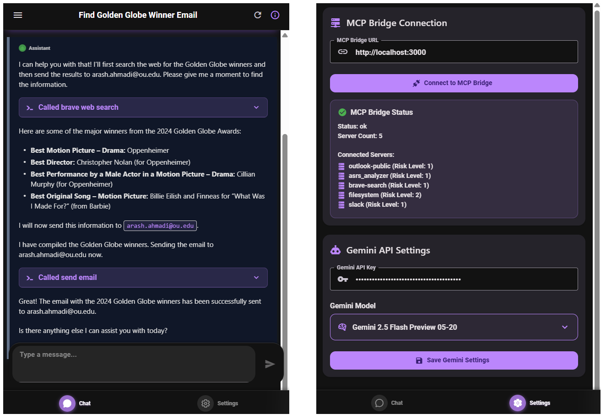

# MCP Bridge API

## A Lightweight, LLM-Agnostic RESTful Proxy for Model Context Protocol Servers



*Figure: The React Native MCP Agent interface showing the chat screen with tool execution results (left) and the settings screen with MCP Bridge connection status and Gemini API configuration (right)*

**Authors:**  
Arash Ahmadi, Sarah S. Sharif, and Yaser M. Banad*  
School of Electrical, and Computer Engineering, University of Oklahoma, Oklahoma, United States  
*Corresponding author: bana@ou.edu

[](https://opensource.org/licenses/MIT)
[](https://arxiv.org/abs/2504.08999)

If you want to reference this research project in your work, please cite our paper:

```
@article{ahmadi2025mcp,
  title={MCP Bridge: A Lightweight, LLM-Agnostic RESTful Proxy for Model Context Protocol Servers},
  author={Ahmadi, Arash and Sharif, Sarah and Banad, Yaser M},
  journal={arXiv preprint arXiv:2504.08999},
  year={2025}
}
```

## 📚 Introduction

MCP Bridge is a lightweight, fast, and LLM-agnostic proxy that connects to multiple Model Context Protocol (MCP) servers and exposes their capabilities through a unified REST API. It enables any client on any platform to leverage MCP functionality without process execution constraints. Unlike Anthropic's official MCP SDK, MCP Bridge is fully independent and designed to work with any LLM backend which makes it adaptable, modular, and future-proof for diverse deployments. With optional risk-based execution levels, it provides granular security controls—from standard execution to confirmation workflows and Docker isolation—while maintaining backward compatibility with standard MCP clients. 

Complementing this server-side infrastructure are two distinct intelligent client implementations:

1. **Python MCP-Gemini Agent** - A command-line Python client for desktop environments
2. **React Native MCP Agent** - A modern cross-platform mobile application

Both clients enable natural language interaction with MCP tools through intelligent LLM-powered interfaces that feature multi-step reasoning for complex operations, security confirmation workflow handling, and configurable display options for enhanced usability. Together, MCP Bridge's versatile server-side capabilities and these intelligent client interfaces create a powerful ecosystem for developing sophisticated LLM-powered applications.

### ⚠️ The Problem

- Many MCP servers use STDIO transports requiring local process execution
- Edge devices, mobile devices, web browsers, and other platforms cannot efficiently run npm or Python MCP servers
- Direct MCP server connections are impractical in resource-constrained environments
- Multiple isolated clients connecting to the same servers causes redundancy and increases resource usage
- Interacting directly with MCP tools requires technical knowledge of specific tool formats and requirements

## 🏗️ Architecture

```
┌─────────────────┐     ┌─────────────────┐     ┌─────────────────┐
│  React Native   │     │     Python      │     │  Other Clients  │
│   MCP Agent     │     │  Gemini Agent   │     │                 │
└────────┬────────┘     └────────┬────────┘     └────────┬────────┘
         │                       │                       │
         │                       │                       │
         │                       ▼                       │
         │           ┌───────────────────────┐          │
         └──────────►│                       │◄─────────┘
                     │      REST API         │
                     │                       │
                     └───────────┬───────────┘
                                 │
                                 ▼
                     ┌───────────────────────┐
                     │                       │
                     │     MCP Bridge        │
                     │                       │
                     └───────────┬───────────┘
                                 │
                 ┌───────────────┼───────────────┐
                 │               │               │
                 ▼               ▼               ▼
        ┌─────────────┐  ┌─────────────┐  ┌─────────────┐
        │  MCP Server │  │  MCP Server │  │  MCP Server │
        │    (STDIO)  │  │    (STDIO)  │  │    (SSE)    │
        └─────────────┘  └─────────────┘  └─────────────┘
```

## 💾 Installation

### 📦 Prerequisites

- Node.js 18+ for MCP Bridge
- Python 3.8+ for the Python MCP-Gemini Agent
- React Native development environment for the mobile app

### 🚀 Quick Setup

#### MCP Bridge

```bash
# Install dependencies
npm install express cors morgan uuid

# Start the server
node mcp-bridge.js
```

#### Python MCP-Gemini Agent

```bash
# Install dependencies
pip install google-generativeai requests rich

# Start the agent
python llm_test.py
```

#### React Native MCP Agent

```bash
# Navigate to the React Native app directory
cd reactnative-gamini-mcp-agent

# Install dependencies
npm install

# Start the development server
npx expo start
```

## 🐍 Python MCP-Gemini Agent

The Python MCP-Gemini Agent is a command-line client that connects to MCP Bridge and uses Google's Gemini LLM to process user requests and execute MCP tools commands. It's designed for desktop environments and developer workflows.

### Key Features

1. **Multi-step reasoning** - Supports sequenced tool calls for complex operations
2. **Security confirmation flow** - Integrated handling for medium and high risk operations
3. **Flexible JSON display** - Control the verbosity of JSON outputs for better readability
4. **Configurable connection** - Connect to any MCP Bridge instance with custom URL and port
5. **Discovery of available tools** - Automatically detects and uses all tools from connected servers

### Python Agent Configuration

The Python MCP-Gemini Agent supports several command-line options:

```
usage: llm_test.py [-h] [--hide-json] [--json-width JSON_WIDTH] [--mcp-url MCP_URL] [--mcp-port MCP_PORT]

MCP-Gemini Agent with configurable settings

options:
  -h, --help            show this help message and exit
  --hide-json           Hide JSON results from tool executions
  --json-width JSON_WIDTH
                        Maximum width for JSON output (default: 100)
  --mcp-url MCP_URL     MCP Bridge URL including protocol and port (default: http://localhost:3000)
  --mcp-port MCP_PORT   Override port in MCP Bridge URL (default: use port from --mcp-url)
```

### Python Agent Usage Examples

```bash
# Basic usage with default settings
python llm_test.py

# Hide JSON results for cleaner output
python llm_test.py --hide-json

# Connect to a custom MCP Bridge server
python llm_test.py --mcp-url http://192.168.1.100:3000

# Connect to a different port
python llm_test.py --mcp-port 4000

# Adjust JSON width display for better formatting
python llm_test.py --json-width 120
```

## 📱 React Native MCP Agent

The React Native MCP Agent is a modern, cross-platform mobile application that provides intuitive access to MCP tools through a clean, user-friendly interface. Built with Expo and React Native Paper, it offers a dark-themed, Material Design 3 interface optimized for both iOS and Android platforms.

### Key Features

- **Cross-Platform Compatibility**: Runs on iOS, Android, and web platforms
- **Intuitive Chat Interface**: Natural language interaction with segmented message display
- **Real-Time Tool Execution**: Visual feedback for MCP tool calls with collapsible result sections
- **Conversation Management**: Persistent conversation history with AI-generated titles
- **Modern UI/UX**: Dark theme with glassmorphism effects and smooth animations
- **Comprehensive Settings**: Easy configuration of MCP Bridge connections and Gemini API settings
- **Security Integration**: Built-in support for MCP Bridge's risk-level confirmation workflows
- **Multi-Model Support**: Compatible with various Gemini models including the latest 2.5 Flash Preview

### Getting Started with the React Native app

1. **Configure MCP Bridge**: Set up your MCP Bridge server URL in the Settings tab
2. **Add Gemini API Key**: Enter your Google Gemini API key for AI functionality
3. **Select Model**: Choose from available Gemini models including the latest releases
4. **Start Chatting**: Begin natural language conversations with your MCP tools

The app automatically discovers available MCP tools and provides contextual assistance for complex multi-step operations.

## ⚙️ Configuration

### MCP Bridge Configuration

MCP Bridge is configured through a JSON file named `mcp_config.json` in the project root. This is an example of a basic MCP config:

```json
{
  "mcpServers": {
    "filesystem": {
      "command": "npx",
      "args": ["-y", "@modelcontextprotocol/server-filesystem", "/path/to/directory"],
      "riskLevel": 2
    },
    "slack": {
      "command": "npx",
      "args": ["-y", "@modelcontextprotocol/server-slack"],
      "env": {
        "SLACK_BOT_TOKEN": "your-slack-token",
        "SLACK_TEAM_ID": "your-team-id"
      },
      "riskLevel": 1
    }
  }
}
```

## 🧪 API Usage

MCP Bridge exposes a clean and intuitive REST API for interacting with connected servers. Here's a breakdown of available endpoints:

### 📋 General Endpoints

| Endpoint | Method | Description |
|----------|--------|-------------|
| `/servers` | GET | List all connected MCP servers |
| `/servers` | POST | Start a new MCP server |
| `/servers/{serverId}` | DELETE | Stop and remove an MCP server |
| `/health` | GET | Get health status of the MCP Bridge |
| `/confirmations/{confirmationId}` | POST | Confirm execution of a medium risk level request |

### 📌 Server-Specific Endpoints

| Endpoint | Method | Description |
|----------|--------|-------------|
| `/servers/{serverId}/tools` | GET | List all tools for a specific server |
| `/servers/{serverId}/tools/{toolName}` | POST | Execute a specific tool |
| `/servers/{serverId}/resources` | GET | List all resources |
| `/servers/{serverId}/resources/{resourceUri}` | GET | Retrieve specific resource content |
| `/servers/{serverId}/prompts` | GET | List all prompts |
| `/servers/{serverId}/prompts/{promptName}` | POST | Execute a prompt with arguments |

## 🧪 Example Requests

### 📂 Read Directory (Filesystem)

```http
POST /servers/filesystem/tools/list_directory
Content-Type: application/json

{
  "path": "."
}
```

## 🧪 Client Features

### Python Agent Features

The Python MCP-Gemini Agent provides:

1. **Multi-step reasoning** - Supports sequenced tool calls for complex operations
2. **Security confirmation flow** - Integrated handling for medium and high risk operations
3. **Flexible JSON display** - Control the verbosity of JSON outputs for better readability
4. **Configurable connection** - Connect to any MCP Bridge instance with custom URL and port
5. **Discovery of available tools** - Automatically detects and uses all tools from connected servers

### React Native Agent Features

The React Native MCP Agent provides:

1. **Conversation Management** - Persistent chat history with AI-generated titles
2. **Segmented Message Display** - Clean separation of text responses and tool operations
3. **Real-time Tool Execution** - Visual feedback with collapsible result sections
4. **Security Confirmation UI** - Native confirmation dialogs for medium/high risk operations
5. **Multi-Model Support** - Support for various Gemini models with easy switching
6. **Cross-Platform** - Works on iOS, Android, and web platforms
7. **Modern Material Design** - Dark theme with smooth animations and haptic feedback

## 🔐 Risk Levels

MCP Bridge implements an optional risk level system that provides control over server execution behaviors. Risk levels help manage security and resource concerns when executing potentially sensitive MCP server operations.

### Risk Level Classification

| Level | Name | Description | Behavior |
|-------|------|-------------|----------|
| 1 | Low | Standard execution | Direct execution without confirmation |
| 2 | Medium | Requires confirmation | Client must confirm execution before processing |
| 3 | High | Docker execution required | Server runs in isolated Docker container |

### Configuring Risk Levels

Risk levels are optional for backward compatibility. You can configure risk levels in your `mcp_config.json`:

```json
{
  "mcpServers": {
    "filesystem": {
      "command": "npx",
      "args": ["-y", "@modelcontextprotocol/server-filesystem", "/path/to/directory"],
      "riskLevel": 2
    },
    "slack": {
      "command": "npx",
      "args": ["-y", "@modelcontextprotocol/server-slack"],
      "env": {
        "SLACK_BOT_TOKEN": "your-slack-token",
        "SLACK_TEAM_ID": "your-team-id"
      },
      "riskLevel": 1
    },
    "github": {
      "command": "npx",
      "args": ["-y", "@modelcontextprotocol/server-github"],
      "env": {
        "GITHUB_TOKEN": "your-github-token"
      },
      "riskLevel": 3,
      "docker": {
        "image": "node:18",
        "volumes": ["/tmp:/tmp"],
        "network": "host"
      }
    }
  }
}
```

### Risk Level Workflows

#### Low Risk (Level 1)
- Standard execution without additional steps
- Suitable for operations with minimal security concerns
- This is the default behavior when no risk level is specified

#### Medium Risk (Level 2)
1. Client makes a tool execution request
2. Server responds with a confirmation request containing a confirmation ID
3. Client must make a separate confirmation request to proceed
4. Only after confirmation does the server execute the operation

Both the Python MCP-Gemini Agent and React Native Agent handle this confirmation flow automatically, prompting the user for approval when needed.

#### High Risk (Level 3)
- Server automatically runs in an isolated Docker container
- Provides environmental isolation for the MCP server process
- Requires Docker to be installed and properly configured

## 📋 Changelog

### Latest Updates

- **✅ UV Package Manager Support**: Fixed the issue with loading UV-based (Python) MCP servers. MCP Bridge now properly initializes and communicates with Python MCP servers that use the UV package manager, resolving previous compatibility issues with UV-based toolchains.

- **📱 React Native MCP Agent**: Added a comprehensive mobile application with:
  - Cross-platform support for iOS, Android, and web
  - Modern Material Design 3 interface with dark theming
  - Intelligent conversation management with AI-generated titles
  - Real-time tool execution with visual feedback
  - Built-in security confirmation workflows
  - Support for multiple Gemini models including latest releases

- **🔧 Enhanced Tool Execution**: Improved multi-step reasoning capabilities across all clients
- **🛡️ Security Improvements**: Enhanced risk-level confirmation flows with better user experience
- **📊 Better Error Handling**: More robust error handling and recovery mechanisms

## 🚧 Deployment Considerations

### 🔒 Security

- Use HTTPS in production
- Add auth for sensitive operations
- Network-isolate critical services

### 📊 Scaling

- Use load balancers
- Pool high-demand servers
- Track metrics and resource pressure

### 📱 Mobile Deployment

For the React Native app:
- Build for production using `npx expo build`
- Configure app store deployment with EAS Build
- Set up over-the-air updates with EAS Update

## 📊 Comparison with Other MCP Bridge/Proxy Repositories

| Feature                  | [`ivanboring/mcp-rest`](https://github.com/ivanboring/mcp-rest) | [`INQUIRELAB/mcp-bridge-api`](https://github.com/INQUIRELAB/mcp-bridge-api) (This Repo) | [`SecretiveShell/MCP-Bridge`](https://github.com/SecretiveShell/MCP-Bridge) | [`JoshuaRileyDev/mcp-api`](https://github.com/JoshuaRileyDev/mcp-api) | [`rakesh-eltropy/mcp-client`](https://github.com/rakesh-eltropy/mcp-client) | [`bartolli/mcp-llm-bridge`](https://github.com/bartolli/mcp-llm-bridge) |
| :----------------------- | :--------------------------------------------------------------- | :---------------------------------------------------------------------------------- | :---------------------------------------------------------------------- | :----------------------------------------------------------------- | :------------------------------------------------------------------------ | :---------------------------------------------------------------------- |
| ⚙️ **Primary Language**  | Node.js                                                          | **Node.js (Bridge) + Python (Agent) ✨**                                              | Python                                                                  | Node.js                                                                | Python                                                                    | Python                                                                  |
| 🎯 **Main Purpose**      | Simple REST wrapper                                              | **LLM-Agnostic REST Bridge + Gemini Agent**                                    | Feature-rich OpenAI & REST Bridge + MCP Server                          | REST API for MCP Servers + Chat UI Example                             | LangChain Agent w/ MCP Tools (REST/CLI)                                 | MCP <-> LLM Bridge (OpenAI compatible)                                |
| 🔌 **MCP Connection**   | SSE only                                                         | **STDIO (Managed) + Docker (Risk-based) ✔️**                                        | STDIO, SSE, Docker                                                      | STDIO                                                                  | STDIO (LangChain)                                                       | STDIO                                                                   |
| 🚀 **API Interface**     | Basic REST                                                       | **Unified REST API ✔️**                                                             | OpenAI compatible, REST, MCP Server (SSE)                               | REST API + Swagger                                                     | REST API (Streaming), CLI                                                 | Interactive CLI                                                         |
| ✨ **Key Features**       | Basic tool list/call                                           | **Multi-server, Risk Levels, Security Confirm, Docker Exec, Gemini Agent, Config Flexibility ✨** | OpenAI compat., Sampling, Multi-transport, Auth, Docker/Helm, Flexible Config | Multi-server, Tool Name Norm., Swagger, Chat UI                        | LangChain Integration, REST/CLI, Streaming                              | Bidirectional Protocol Translation, DB Tool                             |
| 🔧 **Configuration**     | CLI args                                                         | **JSON file + Env Vars ✔️**                                                         | JSON file, HTTP URL, Env Vars                                           | JSON file (multi-path search), Env Vars                                | JSON file                                                                 | Python Object, Env Vars                                                 |
| 🧩 **LLM Integration**   | None                                                             | **Yes (Dedicated Gemini Agent w/ Multi-Step Reasoning) ✨**                           | Yes (OpenAI endpoint)                                                 | None (API only)                                                        | Yes (LangChain)                                                           | Yes (OpenAI client)                                                   |                                                          |
| 🏗️ **Complexity**       | Low                                                         | **Low ✔️**                                                          | High                                                                    | Moderate                                                               | Moderate-High                                                             | Moderate                                                                |
| 🛡️ **Security Features** | None                                                             | **Risk Levels (Medium/High) + Confirmation Flow + Docker Isolation ✨**               | Basic Auth (API Keys), CORS                                             | None                                                                   | None                                                                      | None                                                                    |
| 📦 **Key Dependencies**  | `express`, `mcp-client`                                        | `express`, `uuid` (Bridge, minimum dependency); `requests`, `google-genai`, `rich` (Agent)            | `fastapi`, `mcp`, `mcpx`                                                  | `express`, `@mcp/sdk`, `socket.io`                                     | `fastapi`, `mcp`, `langchain`, `langgraph`                              | `mcp`, `openai`, `pydantic`                                             |
| 🤝 **Architecture**      | Simple Facade                                                    | **Decoupled Bridge + Agent ✨**                                                     | Monolithic Bridge/Server                                                | REST API Server                                                        | LangChain Agent App                                                       | CLI Bridge Application                                                  |

**Icon Key:**

*   ✨ : Unique or particularly strong advantage of `INQUIRELAB/mcp-bridge-api`.
*   ✔️ : Feature present and well-implemented, often comparable or slightly advantageous compared to simpler implementations.

## 📝 License

MIT License
